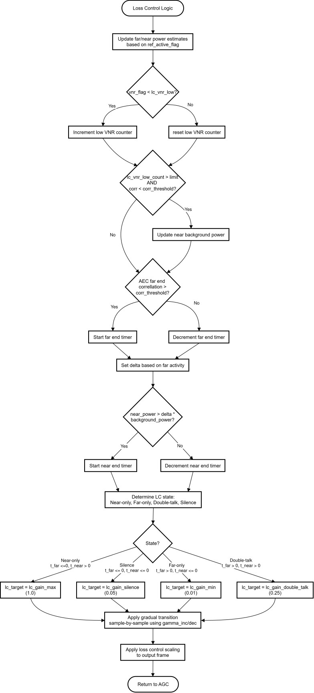

.. _agc_module:

Automatic Gain Control
======================

The AGC provides an API to implement Automatic Gain Control within
an application. The AGC algorithm can dynamically adapt the audio gain,
or apply a fixed gain such that voice content maintains a desired output
level. The AGC uses a :ref:`vnr_module` to normalise
voice content and avoid amplifying noise sources and applies a soft
limiter to avoid clipping on the output. The design is based on standard
modern AGC techniques as detailed in 
`Acoustic Echo and Noise Control <https://ieeexplore.ieee.org/book/5224645>`_ by Hansler and Schmidt.

The gain control can adapt to maintain the amplitude of the peak of the frame
within an upper and lower bound configured for the AGC instance. When used in an
application with the VNR, the AGC will adapt only when
voice activity is detected, so that speech in the input signal is amplified
above other sounds.

The Loss Control process improves the subjective audio quality by
attenuating any residual echo of the reference far-end audio. It is
designed to be used on the communications channel. In cases where there
is both far-end echo and near-end audio then the attenuation is reduced,
allowing listeners to interrupt each other. The Loss Control relies on
the :ref:`aec_module` to classify and attenuate residual far-end
echo.

An optional soft clipping stage is applied at the end of the AGC to
avoid hard clipping of the output signal during sudden loud sounds.

AGC Application
---------------

The AGC takes as input a frame of data from an audio channel. This could be the
microphone input or the output of another module in the application.

Gain control is performed on a frame-by-frame basis. Each frame consists of 15ms
of data, which is 240 samples at 16kHz input sampling frequency. Input data is
expected to be in a fixed-point 32-bit 1.31 format.

Before processing any frames, the application must configure and initialise the
AGC instance by calling :c:func:`agc_init()`. Several parameter sets are provided in
`agc_profiles.h` which can be used to configure the AGC for different
applications. Details on the profiles and key parameters are provided in :ref:`agc_profiles`.

After initialisation, :c:func:`agc_process_frame()` should be called for each frame.
This will update the AGC instance's internal state and produce
the output frame by applying the AGC algorithm to the input frame.
Refer to the :ref:`pipeline_example` to see how to use APIs above.

The gain values in this module for AGC gain and Loss Control gain are
multiplicative factors that are applied to scale the input frame. Therefore, a
fixed gain value of 1.0 (without loss control) will create no change to the input.

If multiple channels need to be processed by the application, or multiple outputs
are required, an independent instance of the AGC must be run for each channel.

AGC Logic
---------

The internal logic of the AGC algorithm is represented in the flow chart
shown in :numref:`agc_logic`. This diagram illustrates the main decision points and processing
steps performed for each input frame. It shows how the AGC determines
whether to adapt the gain based on voice activity, applies peak and
threshold checks, manages loss control, and optionally performs soft
clipping.

.. _agc_logic:

.. figure:: ../images/agc_logic.drawio.svg
    :align: center

    AGC Logic Flow Chart

The logic of the loss control process is shown in the flow chart
in :numref:`loss_control_logic`. This diagram illustrates how the loss control
estimates the state and applies the appropriate attenuation based on
the presence of far-end echo and near-end audio. It is only used when the
loss control feature is enabled in the AGC configuration.

.. _loss_control_logic:

    Loss Control Logic Flow Chart

AGC Parameters
--------------

The key AGC parameters are highlighted below:

.. Descriptions extracted from agc.h struct documentation to avoid sphinx duplication error

* :c:member:`agc_config_t.adapt` - Boolean to enable AGC adaption; if enabled, the gain to apply will adapt based on the peak of the input frame and the upper/lower threshold parameters.
* :c:member:`agc_config_t.vnr_threshold` - VNR threshold for voice activity detection. A higher value will only adapt the AGC on clean speech. A lower value will adapt the AGC on noisy speech, but may also adapt to more non-speech signals.
* :c:member:`agc_config_t.gain` - The current gain to be applied, not including loss control. When `adapt` is false, this gain will be applied to every frame. When `adapt` is true, the initial value of this gain will be applied to the first frame and then it will be adapted on subsequent frames.
* :c:member:`agc_config_t.max_gain` - The maximum gain allowed when adaption is enabled. This can be used to prevent the AGC amplifying very quiet signals.
* :c:member:`agc_config_t.upper_threshold` - The target maximum peak level of the AGC output. If the AGC output goes above this level, the gain is reduced.
* :c:member:`agc_config_t.lower_threshold` - The target minimum peak level of the AGC output. If the AGC output goes below this level, the gain is increased.
* :c:member:`agc_config_t.soft_clipping` - Boolean to enable soft-clipping of the output frame.
* :c:member:`agc_config_t.lc_enabled` - Boolean to enable loss control. The loss control applies additional attenuation when there is no near end speech. This must be disabled if the application doesn't have an AEC or VNR.
* :c:member:`agc_config_t.lc_near_delta` - Delta multiplier used when only near-end activity is detected. How many times louder the near-end signal must be than the background noise when there is no far-end playback. If the near end speech is not heard during silence, reduce this value. If too much non-speech background noise is heard, increase this value.
* :c:member:`agc_config_t.lc_near_delta_far_active` - Delta multiplier used when both near-end and far-end activity is detected. How many times louder the near end signal must be above the residual far-end speech (after the AEC) to be detected during double talk. If the near end speech is not heard during double talk, reduce this value. If there is too much breakthrough of residual far-end echo when there is no near-end speech present, increase this value.
* :c:member:`agc_config_t.lc_gain_double_talk` - Loss control gain to apply when double-talk is detected. Reducing this value will reduce the level of the near-end speech during double-talk, but may help to reduce the level of residual far-end echo that is heard.

Other AGC parameters are described in the `agc_profiles.h` header file,
and are described in detail in :c:struct:`agc_config_t`.
